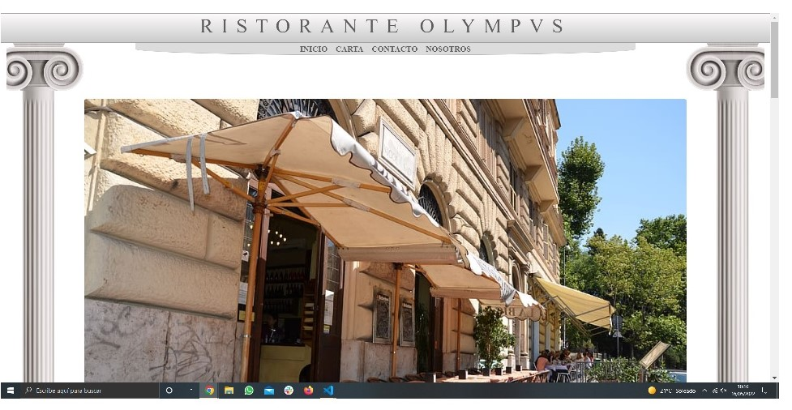

#### PROYECTO: BOCETO DE DISEÑO PARA LA WEB DE UN RESTAURANTE

#### Definición y alcance:

El objeto de este proyecto con fines de aprendizaje, es la realización del diseño de la 
página web de un restaurante ficticio (cualquier parecido con la realidad es una mera 
coincidencia xd). Para ello se ha utilizado HTML y CSS usando el framework Bootstrap.

#### Objetivos:

1- Familiarizarse con las herramientas de bootstrap y CSS para garantizar un comportamiento responsive.

#### Comportamiento y funciones:

La web dispone de 4 páginas, con enlaces de navegación entre ellas:

1- Home, en index.html
2- La carta del restaurante, en menu.html
3- Contacto, en contact.html
4- Información sobre el personal del establecimiento en staff.html

Se ha dispuesto de muchos elementos innecesarios simplemente para experimentar con las 
distintas opciones para hacer el diseño responsive, con elementos que se mostrarán de 
forma distinta (o no se mostrarán) dependiendo del tamaño de la pantalla.

#### ENLACE GITHUB PAGES:

https://antonioml-sc.github.io/Restaurant-web-design/

#### AGRADECIMIENTOS Y CRÉDITOS:

A GeeksHubs, por la formación que estoy recibiendo

A www.freepik.com, por el diseño original de las columnas
